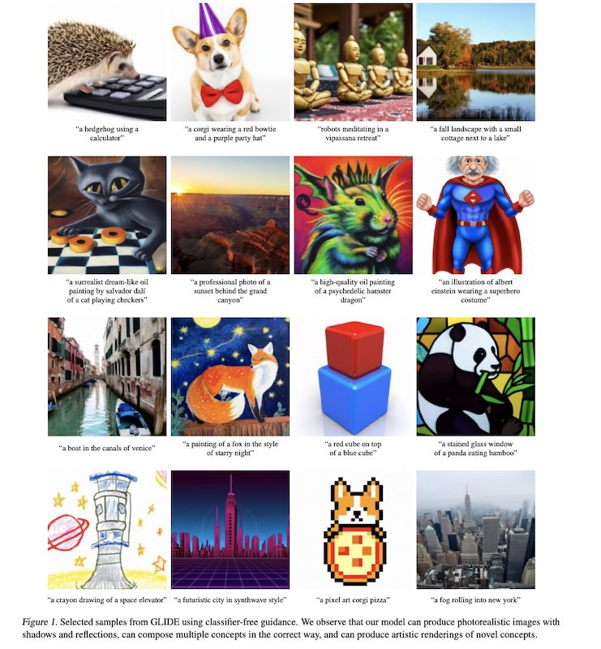
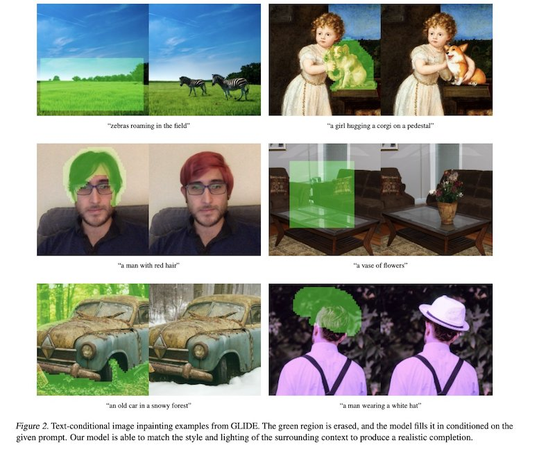
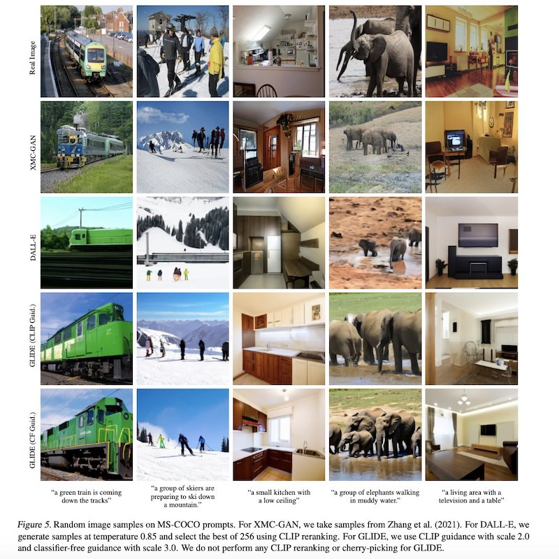

# GLIDE

This is sample repo reproducing the official codebase for running the small, filtered-data GLIDE model from [GLIDE: Towards Photorealistic Image Generation and Editing with Text-Guided Diffusion Models](https://arxiv.org/abs/2112.10741).

For more information, please see the original repo here: https://github.com/openai/glide-text2im/.





## How to run

 * The [text2im](notebooks/text2im.ipynb) [](https://studiolab.sagemaker.aws/import/github/machinelearnear/openai-glide-text2im/blob/main/text2im.ipynb) notebook shows how to use GLIDE (filtered) with classifier-free guidance to produce images conditioned on text prompts. 
 
 * The [inpaint](notebooks/inpaint.ipynb) [](https://studiolab.sagemaker.aws/import/github/machinelearnear/openai-glide-text2im/blob/main/inpaint.ipynb) notebook shows how to use GLIDE (filtered) to fill in a masked region of an image, conditioned on a text prompt. 
 
 * The [clip_guided](notebooks/clip_guided.ipynb) [](https://studiolab.sagemaker.aws/import/github/machinelearnear/openai-glide-text2im/blob/main/clip-guided.ipynb) notebook shows how to use GLIDE (filtered) + a filtered noise-aware CLIP model to produce images conditioned on text prompts.
 
## References
```
@misc{nichol2021glide,
      title={GLIDE: Towards Photorealistic Image Generation and Editing with Text-Guided Diffusion Models}, 
      author={Alex Nichol and Prafulla Dhariwal and Aditya Ramesh and Pranav Shyam and Pamela Mishkin and Bob McGrew and Ilya Sutskever and Mark Chen},
      year={2021},
      eprint={2112.10741},
      archivePrefix={arXiv},
      primaryClass={cs.CV}
}
```